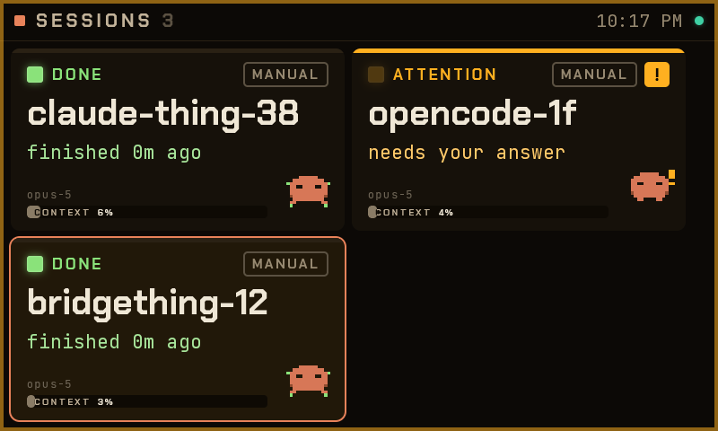
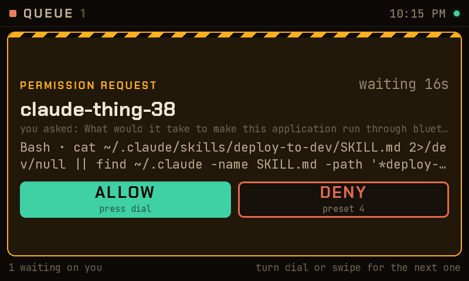
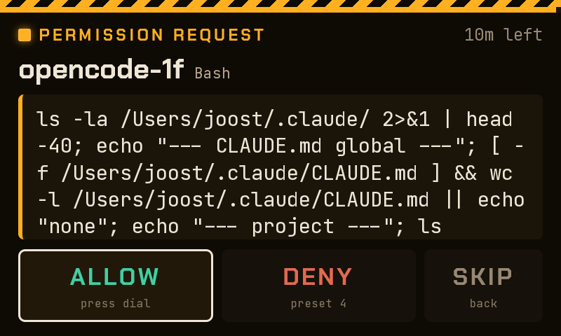
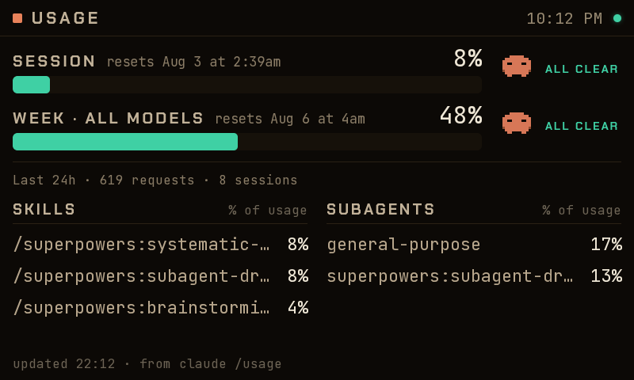
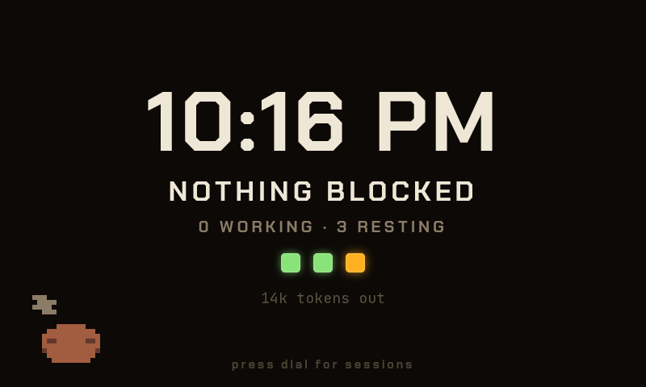

# claude-thing

Turn a Spotify Car Thing into a desk monitor for Claude Code: every session at a
glance, a queue of everything waiting on you, live usage bars, and permission
approve/deny from the dial.



<details>
<summary><b>More screens</b> — queue, permission prompt, usage, ambient clock</summary>
<br>
<table>
<tr>
<td width="50%"></td>
<td width="50%"></td>
</tr>
<tr>
<td><sub><b>Queue</b> — everything waiting on a human, newest filling the screen.</sub></td>
<td><sub><b>Permission</b> — the real prompt. The dial answers it.</sub></td>
</tr>
<tr>
<td width="50%"></td>
<td width="50%"></td>
</tr>
<tr>
<td><sub><b>Usage</b> — real session and weekly limits, with reset times.</sub></td>
<td><sub><b>Ambient</b> — the clock, when nothing needs you.</sub></td>
</tr>
</table>
</details>

---

## What you'll need

- A **Mac**, and a **Car Thing already running bridgething**.
- A **USB-C cable that carries data** — charge-only cables will not work.
- **Node 18+**, **[bun](https://bun.sh)**, and **Claude Code** installed and
  signed in.

Check the three:

```sh
node -v && bun --version && claude --version
```

## Install

```sh
git clone <this repo> && cd claude-thing
./mac/install.sh
```

That installs dependencies, builds the control page, merges the Claude Code hooks
into `~/.claude/settings.json` (**a backup is written first, and nothing you
already had is removed**), and installs two LaunchAgents — the daemon and the
tunnel keeper.

When it finishes, <http://127.0.0.1:8790> should serve the control page.

Then plug the Car Thing in over USB and push the app onto it:

```sh
bun run push
```

The device switches to it immediately. Your sessions should appear.

To undo everything: `./mac/uninstall.sh`.

### Or install the app from the catalog

The device half is published as a bridgething catalog source. Add this url in the
companion app and install **Claude** from it:

```
https://raw.githubusercontent.com/jstgnkl/bridgething-claude/main/docs/catalog.v1.json
```

That replaces `bun run push` only. The Mac daemon, the hooks and the tunnel still
come from `./mac/install.sh` — without them the app has nothing to talk to and
shows `DAEMON OFFLINE`.

## Using it

| Control | What it does |
|---|---|
| **Preset 1** | **Sessions** — every session, its state, model, context fill and an animated mascot. |
| **Preset 2** | **Queue** — everything waiting on a human. The next one fills the screen. |
| **Preset 3** | **Usage** — real session and weekly limits, with reset times. |
| **Preset 4** | Denies the permission on screen. |
| **Dial** | Turn to move, **press to select or allow**. |
| **Back** | Up a level. |
| **M** | Ambient clock. |
| **Touch** | Everything on screen is tappable. |

Two things worth knowing:

**Permissions are answered for real.** Allow/deny from the dial is the actual
decision — the daemon holds Claude Code's permission hook open until you answer.
Multiple-choice questions can't work that way, so answering one focuses that
session's terminal and types the option number instead; that needs macOS
**Automation → System Events**.

**Nothing ever auto-denies.** If the daemon is down, or nobody answers in time,
the prompt goes back to the terminal untouched.

**The hooks are global.** Every Claude Code session on this Mac routes its
permission prompts through the daemon, including whichever one you use to work on
this repo. That is the point, but it does mean your own tooling shows up in the
queue.

## How it works

```
Car Thing kiosk (chromium 800x480, --proxy-server=socks5://127.0.0.1:1080)
  └─ this webapp                   http://127.0.0.1:8891/
       └─ WebSocket ────────────►  ws://127.0.0.1:8790/ws
                                        ▲
                    reverse SSH tunnel over the USB link
                                        │
Mac ── claude-thing daemon on 127.0.0.1:8790
        ├─ Claude Code hooks (PermissionRequest, PreToolUse, …)
        ├─ claude agents --json, transcripts
        └─ claude -p "/usage"
```

The kiosk's chromium proxies **everything except loopback** through a SOCKS proxy
that nothing here is listening on, so that path is dead. The tunnel instead puts
the Mac daemon on the device's *own* loopback, where the kiosk reaches it
directly — and the daemon keeps its `127.0.0.1` bind, so the permission API is
never exposed to a network interface.

| Path | What |
|---|---|
| `src/` | The device app (vanilla ES modules, string-builder screens). |
| `daemon/` | The Mac daemon on `127.0.0.1:8790`. Upstream's Bluetooth connector relay removed. |
| `webpage/` | The Mac control page. Upstream's Bluetooth page removed. |
| `mac/` | `install.sh`, `uninstall.sh`, `tunnel.sh`, LaunchAgent templates. |
| `scripts/` | `push`, `share`, and the device tools below. |

The app registers with the daemon's hub as `role: "device"`; the hub accepts any
string.

## Developing

```sh
bun run dev     # vite at 800x480 in any browser — talks to 127.0.0.1:8790 directly
bun run test    # 88 unit tests, no device needed
bun run build
bun run push    # build + install onto the connected device
```

To cut a catalog release, bump `version` in `public/manifest.json`, then:

```sh
bun run release --changelog "what changed"
```

That writes `docs/claude-thing-bridgething-v<version>.zip` (dist/ at the zip root,
sourcemaps excluded) and folds the version into `docs/catalog.v1.json` with its
size and sha256. Commit and push both — the catalog url serves straight off
`main`, so a release is live the moment it lands. Never edit the `id` in
`public/manifest.json`: it keys upgrade-in-place and the device's key-value
namespace.

The dev loop needs no device and no tunnel — the daemon is already on the Mac's
loopback. Save the hardware for final checks.

Three tools for driving real hardware, all raw-WebSocket CDP (**Playwright's
`connectOverCDP` hangs against this chromium**):

```sh
node scripts/device.mjs shot.png    # screenshot + banner/route state
node scripts/press.mjs 2            # press a control: 1-4, Enter, Escape, m, dial+, dial-
node scripts/measure.mjs            # assert screen geometry in a real 800x480 Chrome
```

`press.mjs Enter` and `press.mjs 4` **answer real permission requests**.

`measure.mjs` is the one that catches layout bugs the unit tests structurally
cannot — the screens are string builders, so a card that lays out 30px taller
than its container is invisible to them. It needs a headless Chrome; see its
header for the invocation.

## Troubleshooting

**The device shows the launcher, not the app.** A device reboot can wipe `/var`,
taking the installed webapp with it. Re-push.

**"DAEMON OFFLINE — CHECK THE MAC TUNNEL".** In order: is the daemon up
(`launchctl list | grep claudething`), is the tunnel up (`pgrep -f 'ssh -N -R'`),
and does the device see it —

```sh
/usr/bin/ssh root@10.42.1.178 'wget -q -O - -T 5 http://127.0.0.1:8790/status'
```

After a reconnect the banner can take up to 30s to clear — that is the app's
backoff, not a failure.

**The tunnel won't start.** Something else may already hold the device's port
8790; `ExitOnForwardFailure` makes that fail loudly rather than forward nothing.
Kill the stale `ssh -N -R` and let launchd retry.

**After reflashing the device**, its SSH host key changes:
`rm ~/.ssh/known_hosts_carthing`.

**Use `/usr/bin/ssh`,** not `ssh`, if your shell aliases it (e.g. to Kitty's ssh
kitten) — the alias breaks non-interactive use.

## Status

Working on real hardware over the SSH tunnel: the app renders live session data,
the controls all map correctly, the usage screen shows real limits, and a dial
press answers a real permission request end to end.

> A port of [claude-thing](https://github.com/rithkott/claude-thing) to the
> [bridgething](https://github.com/JoeyEamigh/bridgething) Car Thing image.

## License

The launcher icon (`public/icon.svg`) is Anthropic's Claude mark, used to
identify the Claude Code sessions this app monitors. It is Anthropic's
trademark, not covered by this repo's licence.

GPL-3.0 — see [LICENSE](LICENSE), matching
[Nocturne](https://github.com/usenocturne/nocturne) upstream, which
[claude-thing](https://github.com/rithkott/claude-thing) forks and this ports.
The Car Thing platform work, Nocturne, bridgething and claude-thing all belong to
their respective authors; this repo only moves one of them onto another.
